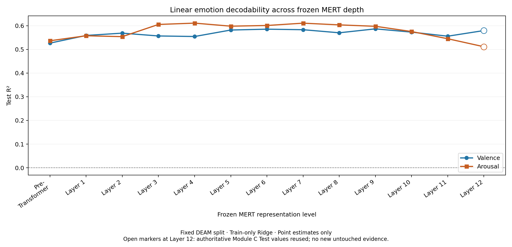

# Probing Musical Emotion in Pretrained Music Representations

This project investigates whether continuous musical emotion information can be decoded from pretrained MERT representations using the DEAM dataset.

## Research Questions

1. Can continuous Valence and Arousal be decoded from frozen MERT representations?
2. How does linear Valence and Arousal decodability vary across the 13 frozen MERT representation levels?
3. Do MERT representations provide emotion-related information beyond traditional low-level audio features?
4. To what extent might prediction performance be explained by confounding factors such as tempo and energy?

The questions above preserve the project's conceptual directions. The [original README](https://github.com/Yumek077/mert-emotion-probing/blob/b8955d5/README.md) records its initial intentions; the frozen [Post-Module-D Research Roadmap](docs/research_roadmap_after_module_d.md) defines the refined operational RQ3/RQ4 and scope for Modules E/F.

## Method Overview

DEAM Audio
→ Audio Preprocessing
→ Frozen MERT-v1-95M
→ Layer-wise Hidden Representations
→ Simple Regression Probes
→ Valence / Arousal Prediction

MERT remains frozen in the main experiments.

## Project Roadmap

Modules A–C are complete: the data protocol, canonical frozen representations,
fixed split, and pre-specified Layer-12 probing have been verified.
Module D implementation, verification, ChatGPT research interpretation review,
and the researcher learning checkpoint are complete. Its research protocol and
results are accepted for project use; RQ2 is complete under the frozen protocol.

Module E / operational RQ3 is finalized under the frozen protocol. The acoustic
baseline and the authoritative Module C Layer-12 results have been compared on
the same fixed Test split; the researcher learning checkpoint material and final
interpretation review are complete.

The remaining research is:

- Module F — Acoustic Correlate / Confound & Error Analysis / RQ4: design is next; core focus is Tempo/Energy. It has not started.
- Final Synthesis: connect RQ1–RQ4. Optional extensions remain deferred until the core evidence chain is complete.

The authoritative research records are in [`docs/research_logs/`](docs/research_logs/).
The latest record is
[`Module E — Conventional Acoustic Baseline / RQ3`](docs/research_logs/module_e_conventional_acoustic_baseline.md).

## Evaluation

- MAE
- R²
- Pearson correlation (r)

Valence and Arousal are evaluated separately. Module D reports point estimates
from the fixed split with Train-only Ridge fitting and Validation-only alpha
selection. Its primary result is the full depth trajectory, not a best-layer claim.

## Repository Structure

- `configs/`: Experiment configuration files
- `notebooks/`: Exploratory and analysis notebooks
- `src/`: Reusable project source code
- `scripts/`: Command-line workflow scripts
- `data/`: Raw, processed, and metadata files
- `outputs/`: Embeddings, results, and figures
- `docs/`: Project documentation

Raw DEAM audio, large processed data, model weights, and cached MERT embeddings are intentionally excluded from version control.

## Environment

This project uses Python 3.10 with CUDA-enabled PyTorch and has been tested locally on an NVIDIA RTX 4060 Laptop GPU. The environment specification is provided in `environment.yml`.

## Status

Work in progress.

Current stage:
Module E / RQ3 finalized under the frozen protocol, including the researcher
learning checkpoint material and final interpretation review. The next research
task is Module F / RQ4 design; no Module F experiment has started.

The pre-specified MERT Layer-12 representation has lower Test MAE and higher
Test R²/Pearson r than the frozen 51-D conventional acoustic baseline for both
targets. Acoustic Test R² is 0.368150 for Valence and 0.374162 for Arousal;
authoritative MERT Layer-12 R² is 0.579780 and 0.511422. This descriptive
comparison does not establish unique information or statistical superiority.
The MERT values reuse Module C evidence. See the
[`RQ3 comparison table`](outputs/results/module_e_stage3_rq3_comparison.csv) and
[`Module E technical report`](docs/codex_reports/module_e_stage3_frozen_test_evaluation_and_rq3_comparison.md).

Both targets are linearly decodable at all 13 tested levels under the fixed
protocol. Valence is comparatively stable after early gains; Arousal has a broad
middle-depth high region followed by a late decline. Layer-12 Test values reuse
the authoritative Module C evaluation and are not new untouched evidence.

Full numerical results: [`Module D table`](outputs/results/module_d_stage1_layerwise_results.csv).
Implementation, commands, verification, and limitations:
[`Module D technical report`](docs/codex_reports/module_d_stage1_layerwise_emotion_decodability_analysis.md).

## Scope

The first version of this project includes:

- No MERT fine-tuning
- No foundation-model training
- No music generation
- No large-scale human study
