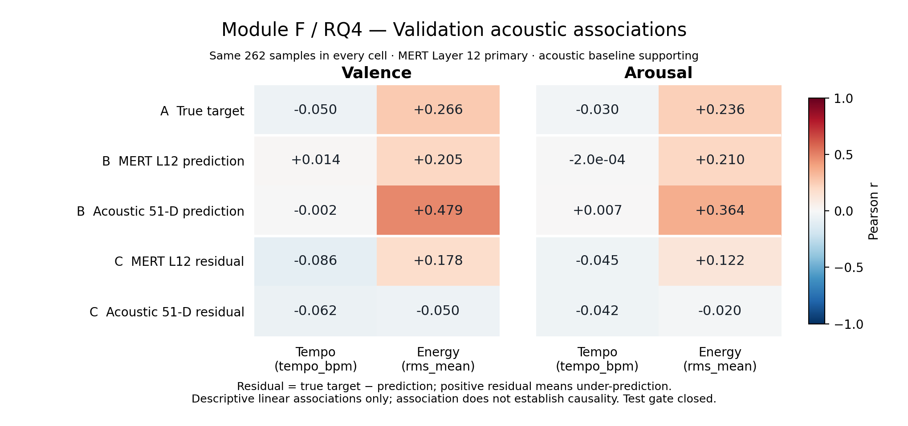

# Module F Stage 1 — Validation Acoustic Association Analysis

## Objective and status

**Operational RQ4: To what extent are the observed emotion-decoding results associated with simple acoustic correlates, particularly Tempo and Energy?**

Stage 1 implements the researcher-reviewed design supplied for this task: descriptive Pearson associations on the frozen Validation partition only. It connects the preceding evidence chain, **can decode → where across depth → compared with conventional acoustics → alternative acoustic explanations**. The purpose is to assess plausible partial acoustic explanations for existing decoding results.

**Implementation and independent verification passed. Researcher + ChatGPT review is pending. The Module F Test gate remains closed.** Module F is not finalized, and Stage 2 is not authorized.

Repository context was recovered from the workflow, roadmap, README, A–E research logs, relevant C/E Validation artifacts, acoustic extraction diagnostics and source schemas. The roadmap and README retain their earlier planning status; this task supplies the subsequently frozen Stage 1 design. No earlier research decision or historical document was rewritten.

## Frozen design implemented

| Component | Stage 1 definition |
|---|---|
| Partition | Exactly the 262 frozen Validation Sample IDs |
| Targets | Separate original-scale static Valence and Arousal |
| Tempo | Cached `tempo_bpm` |
| Energy | Cached `rms_mean` |
| Primary model | Saved Module C predictions from pre-specified MERT Transformer Layer 12 |
| Supporting comparator | Saved Module E predictions from the frozen 51-D acoustic baseline |
| Statistic | Pearson correlation coefficient, `r` |
| Residual | `y_true - prediction` |
| Sign convention | **Positive residual = model under-predicts the target** |

No model, scaler, alpha, representation, split, feature definition or label was changed. No audio feature extraction, Tempo estimation, MERT inference, Ridge fitting, alpha tuning, Train + Validation refitting, layer sweep or feature screening was performed. No p-value, significance test, bootstrap interval, partial correlation, conditional regression or nonlinear statistic was computed. Genre, Instrumentation, additional datasets and post-hoc robustness experiments are outside this Stage.

## Inputs and provenance

| Authoritative input | Use |
|---|---|
| `data/metadata/deam_primary_split_seed42.csv` | Frozen population and Validation identity |
| `data/raw/deam/verification/deam_item_mapping.csv` | Sample-ID-keyed original-scale labels |
| `data/processed/deam_acoustic_51d.npz` | Saved acoustic values, IDs and feature names |
| `outputs/results/module_c_stage3_validation_predictions.csv` | Existing selected MERT Layer-12 Validation predictions |
| `outputs/results/module_c_stage3_validation.json` | Representation, selected alpha, target mapping and fitting provenance |
| `outputs/results/module_e_stage2_validation_predictions.csv` | Existing selected acoustic Validation predictions |
| `outputs/results/module_e_stage2_validation.json` | Frozen 51-D representation, selected alpha and input identities |
| `outputs/results/module_e_stage1_acoustic_diagnostics.json` | Accepted extraction protocol and ordered feature names |
| `data/processed/deam_acoustic_sample_diagnostics.csv` | Existing ID 437 measurement diagnostic |

MERT predictions use the already selected alpha 1000 for each target. The acoustic predictions use the already selected alpha 100 for Valence and 10 for Arousal. Those are provenance facts, not new selections. Both branches inherited Train-only scaling and fitting. Validation was previously used for alpha selection; these associations therefore describe the accepted Validation predictions, rather than an independent model evaluation.

The split and mapping SHA-256 identities match both C3 and E2. The cache and Stage 1 diagnostics match E2, and the C3 JSON matches E2's recorded identity. The acoustic cache SHA-256 is `a737863c8c2bfb623448fe1d2d770e27206b9f42bee57faacf86ef739da0b6c4`; the split SHA-256 is `edb62f433e95fe6d5e33302fff546ce34fa90e486834474ee27b0fea9d56140a`. Full input, output and script hashes are retained in the single verification JSON. Existing tracked files outside the exact Stage 1 file set match Git HEAD; this also protects the existing C/E prediction artifacts.

## Sample-ID alignment and partition boundary

The unchanged split contains 1,744 unique primary IDs with 1,221 Train, 262 Validation and 261 Test assignments. The cache has 1,744 unique int64 IDs, the same population, and a float32 `[1744, 51]` feature matrix. Feature columns are resolved by the NPZ's saved `feature_names`, not assumed from position: `tempo_bpm` resolves to index 0 and `rms_mean` to index 1. All 51 ordered names agree with the accepted E1/E2 records; only these two columns enter association analysis.

Each source prediction CSV contains 524 rows and exactly 262 IDs per target. **Sample ID alone is not a prediction-row unique key:** each item has a Valence row and an Arousal row. The validated key is `(sample_id, target)`; MERT representation fields are additionally required to be uniformly Layer 12/index 12. There are no duplicate keys, missing IDs, extra IDs or non-Validation prediction rows.

Labels, cache values and both prediction branches are retrieved through explicit Sample-ID keys. For each target, both saved `y_true` arrays equal the frozen labels exactly under round-trip float parsing. The derived analysis CSV has 524 unique Sample-ID/target rows. Its targets, features and predictions reproduce source values exactly; both residual columns reproduce saved `y_true - prediction` exactly.

The split is read for identity/count verification. The monolithic NPZ is loaded as an existing storage artifact, but only Validation rows and the two named feature columns enter the calculations. The monolithic label mapping is read for identity; numeric targets are parsed only after confirming Validation membership. SHA-256 hashing of the existing inputs is an integrity operation, not an association analysis. **No C/E Test prediction file is opened, no Test feature/target pair is analyzed, and no Module F Test result is generated.**

## Tempo and Energy measurement definitions

Tempo is the frozen Module E automated global BPM estimate. It remains subject to weak onset/beat evidence and half/double-tempo ambiguity. Finite BPM does not establish ground-truth tempo.

Energy is the temporal mean of frame RMS from decoded audio → arithmetic mono conversion → 24 kHz resampling, with the existing 2,048-sample frame and 512-sample hop. It is a **decoded-amplitude signal-level energy proxy**, influenced by recording gain and production. It is neither calibrated perceptual loudness nor the Arousal target. `whole_waveform_rms` and `rms_std` do not enter the primary definition. No logarithm, target scaling or other transformation was added.

ID 437 retains its cached 117.1875 BPM estimate and one-beat uncertainty diagnostic. Its frozen assignment is **Train**, so it is naturally outside this Validation analysis; it was not dropped because of its measurement or any result. No BPM was corrected, re-estimated or substituted.

## Three-layer analysis

- **Layer A — correlate ↔ true target:** describes whether Tempo/Energy covary linearly with the emotion annotations in these Validation samples.
- **Layer B — correlate ↔ prediction:** describes whether existing MERT predictions track Tempo/Energy-associated structure. The acoustic branch supplies a supporting comparison within the same samples.
- **Layer C — correlate ↔ residual:** describes whether remaining signed prediction error still covaries linearly with Tempo/Energy.

The complete table contains two targets × two correlates × five analysis objects = **20 associations**, each with **n = 262**. Pearson `r` is computed on finite float64 views of the saved values. A constant input would produce an empty CSV `pearson_r`, `statistic_status=undefined_constant_input`, and a corresponding JSON record, rather than an invented zero or replacement statistic. No such case occurred.

Prediction association adds information about the model's output behavior beyond target association. Residual association adds information about how the signed error varies with a correlate. Neither analysis estimates conditional effects or attributes a fraction of performance to a feature. In particular, `r(correlate, residual)` cannot be obtained by subtracting target and prediction correlations: covariance is additive, but the three correlations use different standard deviations.

## Validation results

All values below are Pearson `r`, rounded to nine decimal places. The CSV retains full precision.

| Analysis object | Valence: Tempo | Valence: Energy | Arousal: Tempo | Arousal: Energy |
|---|---:|---:|---:|---:|
| A — True target | -0.049586240 | 0.265603429 | -0.029830940 | 0.235628997 |
| B — MERT Layer-12 prediction | 0.013909667 | 0.205488967 | -0.000198471 | 0.209698701 |
| B — Acoustic 51-D prediction | -0.001613054 | 0.479110499 | 0.006838595 | 0.364226761 |
| C — MERT Layer-12 residual | -0.085964007 | 0.177979468 | -0.045116130 | 0.122147929 |
| C — Acoustic 51-D residual | -0.061929745 | -0.049686258 | -0.042246212 | -0.020145718 |



One compact figure uses matched diverging scales from -1 to +1, with separate Valence/Arousal panels, Tempo/Energy columns and the five analysis objects. It shows every association; there are no selected scatter plots, fitted trend curves or uncertainty bands. An SVG of the same figure is saved for scalable reuse. The PNG was visually inspected for clipping and readability.

### Main descriptive patterns

**Tempo:** all ten associations have small absolute values, at most approximately 0.086. True-target correlations are slightly negative; prediction correlations are nearly zero; signed-residual correlations are slightly negative. This Stage provides little descriptive evidence of a simple linear relationship with this cached Tempo estimate. It does not rule out other tempo-related structure or measurement limitations.

**Energy and the targets/predictions:** Energy has positive associations with true Valence (0.266) and Arousal (0.236). MERT predictions also have positive associations, around 0.205–0.210. This is consistent with MERT outputs tracking some Energy-associated structure and provides a plausible partial acoustic explanation for the observed emotion decoding. It does not measure how much of MERT performance Energy explains.

**Energy and residuals:** MERT residuals retain positive Energy association: 0.178 for Valence and 0.122 for Arousal. Higher Energy is associated with larger signed residuals, a tendency toward greater under-prediction or less over-prediction. This does not mean every high-Energy item is under-predicted or establish a positive average residual. The acoustic baseline's residual Energy associations are small and slightly negative (-0.050 and -0.020).

**Supporting acoustic comparison:** acoustic predictions have larger Energy correlations (0.479/0.364) than MERT predictions, while their residual correlations are nearer zero. The acoustic representation already includes RMS and Tempo among its 51 features. This is a descriptive output/error pattern, not evidence that the acoustic model is more accurate overall, exhausts acoustic information, or explains the MERT representation. Small residual correlation does not mean small error or independence.

## Independent verification

The separate verifier does not import the runner. It reopens the saved analysis, associations, source predictions, labels, cache and metadata, constructs ID dictionaries with reversed source order, and independently recomputes Pearson `r` using centered sums with Python `math.fsum`:

`r = sum((x - mean(x)) * (y - mean(y))) / sqrt(sum((x - mean(x))^2) * sum((y - mean(y))^2))`

This differs from the runner's pandas-based joins and `numpy.corrcoef`. The result is **20/20 matching associations**, maximum absolute difference **2.7755575615628914e-16**, within the specified implementation tolerance of `1e-12`. This tolerance is a numerical verification tolerance, not a confidence interval. All exact saved-value and residual checks pass. There are no nonfinite or undefined association values.

The [verification artifact](../../outputs/results/module_f_stage1_pre_test_verification.json) records 15 runner checks and 17 independent checks, all passing. They cover frozen input identities and population, counts, composite prediction keys, Sample-ID alignment, exact labels/features/predictions/residuals, original target scale, feature names, prediction provenance, row-order independence, independent Pearson reproducibility, numerical edge handling, unchanged inputs and existing tracked A–E files, execution scope and the closed Test gate. No fitting or extraction function is imported or called by either script; the explicit input set contains only the listed existing artifacts. No Test association analysis occurred.

## Unexpected observations and interpretation boundaries

Observations for researcher review are the near-zero Tempo associations and the fact that the Energy–true-target correlation is numerically a little larger for Valence than for Arousal on this split. The latter is a descriptive difference, not a claim that the population relationships differ. No result-dependent feature change, sample exclusion or additional experiment was introduced.

No schema conflict, alignment failure, invalidating numerical edge case or unresolved implementation problem was found. The known Tempo measurement limitation remains recorded. The finding is specific to these 262 samples, the cached measurements and the accepted predictions.

Association must not be interpreted as causal confounding. These results do not establish that Tempo/Energy cause MERT performance, prove acoustic independence, identify unique emotion information beyond acoustics, demonstrate high-level emotion understanding, support statistical significance, or establish universal relationships. Near-zero Pearson correlations do not establish absence of all dependence. The analysis does not provide a controlled or conditional explanation.

## Pre-Test gate

The machine-readable gate is **closed**, even though Stage 1 verification passed. Researcher + ChatGPT review of the Validation artifacts and interpretation must precede any Stage 2 authorization. There is no partition switch or Test execution path in the Stage 1 scripts.

If subsequently approved, Stage 2 must apply the same frozen definitions, statistic, three-layer structure and model predictions to Test without adapting them to these observations. **Test was already viewed in Modules C–E. Future Module F Test associations are not untouched confirmatory evidence; they can only check consistency of the frozen descriptive patterns on that partition.** No Stage 2 code or Module F Test artifact was created here.

## Files and exact reproducibility commands

All eight Stage files are new:

- `scripts/run_acoustic_association_validation.py`: Validation-only assembly, associations and summary figure.
- `scripts/verify_acoustic_association_validation.py`: independent artifact/identity/numerical verification.
- `outputs/results/module_f_stage1_validation_analysis_data.csv`: 524 aligned rows supporting exact recomputation.
- `outputs/results/module_f_stage1_validation_associations.csv`: 20 full-precision results with partition, target, analysis object, correlate, type, sample count and residual sign metadata.
- `outputs/results/module_f_stage1_pre_test_verification.json`: combined provenance, verification and explicit gate, avoiding separate fragmented records.
- `outputs/figures/module_f_stage1_validation_associations.png` and `.svg`: one summary figure in two formats.
- `docs/codex_reports/module_f_stage1_validation_acoustic_association_analysis.md`: this report and researcher checkpoint.

Run with the existing project environment and local frozen cache/mapping, from the repository root:

```powershell
Set-Location -LiteralPath 'C:\Users\Rinshinozaki\Documents\ChatGPT\AI music mini proj\mert-emotion-probing'
& 'C:\Users\Rinshinozaki\miniconda3\envs\mert-emotion\python.exe' -m py_compile scripts/run_acoustic_association_validation.py scripts/verify_acoustic_association_validation.py
& 'C:\Users\Rinshinozaki\miniconda3\envs\mert-emotion\python.exe' scripts/run_acoustic_association_validation.py
& 'C:\Users\Rinshinozaki\miniconda3\envs\mert-emotion\python.exe' scripts/verify_acoustic_association_validation.py
git status --short
git diff --stat
```

The runner leaves independent verification pending; the verifier marks the combined result passed only after reopening and checking it. A verification rerun first invalidates any previous pass so a failing rerun cannot preserve stale success. Verification passing never opens Test. Running the commands replaces only the same Stage artifacts. The scripts permit reproducing their own tracked Stage files after a future commit, while checking that other existing tracked files match HEAD. Numerical CSVs use 17 significant digits and round-trip parsing. Figure/JSON timestamps and hashes may change on regeneration; the scientific table is deterministic.

Runtime: Python 3.10.21, NumPy 2.2.6, pandas 2.3.3, matplotlib 3.10.9. No dependency installation or environment modification was required.

At task start and completion, branch is `main`, HEAD is `6957bf485fc70d807d15807ce7126303f83b0a31`. No tracked pre-existing file changed; the tracked diff is empty. The eight Stage files are untracked pending review. Pre-existing `docs/.obsidian/` remains untracked and untouched. Nothing was staged, committed or pushed. No Module-level final log or personal note was created.

## What I should now be able to explain

- **Why check Tempo/Energy?** Earlier Modules show decodability and representation differences, but simple acoustic cues could plausibly contribute to those results. RQ4 examines two agreed correlates without reopening the accepted experiments.
- **What do the three layers answer?** A asks whether a cue follows the labels; B asks whether it follows the model's outputs; C asks whether it still follows signed error. Each describes a different part of the evidence chain.
- **Why go beyond target correlation?** A cue may covary with labels while a particular model tracks it weakly or leaves cue-related error. Prediction and residual associations reveal those descriptive differences, without identifying a causal mechanism.
- **Why keep the acoustic baseline supporting?** It provides a reference output/error pattern under the accepted conventional representation. RQ4 remains about plausible acoustic explanations of observed decoding, rather than becoming a new model-comparison question.
- **What does Pearson r mean?** Its sign describes the direction of linear covariation and its magnitude describes the standardized linear association in these samples. It does not give an effect in rating units, a causal effect, a conditional relationship or a fraction of decoding performance explained.
- **Why is this not causal confounding?** The cues, recordings, labels and predictions are observed together, with no intervention or causal identification. Other shared properties and measurement uncertainty remain possible.
- **What did Validation show?** Tempo correlations are near zero. Energy follows both labels and MERT predictions positively, with smaller positive associations remaining in MERT residuals. Acoustic predictions follow Energy more strongly, but their residual Energy correlations are near zero. These are descriptive patterns, not proof of accuracy, independence or unique emotion information.
- **What does a positive residual mean?** The model predicted below the observed label. A positive Energy–residual correlation describes a tendency in signed error, not a statement about every item.
- **Why does Test stay gated?** Validation implementation and interpretation need review before the same analysis is applied to Test. Existing C–E Test exposure must remain explicit; a later consistency check cannot become untouched confirmatory evidence by being placed in a new Module.

There is no unresolved issue requiring a frozen-design change. The remaining researcher decision is the prescribed Stage 1 review and, only after that review, whether to authorize Stage 2. Work stops here.
