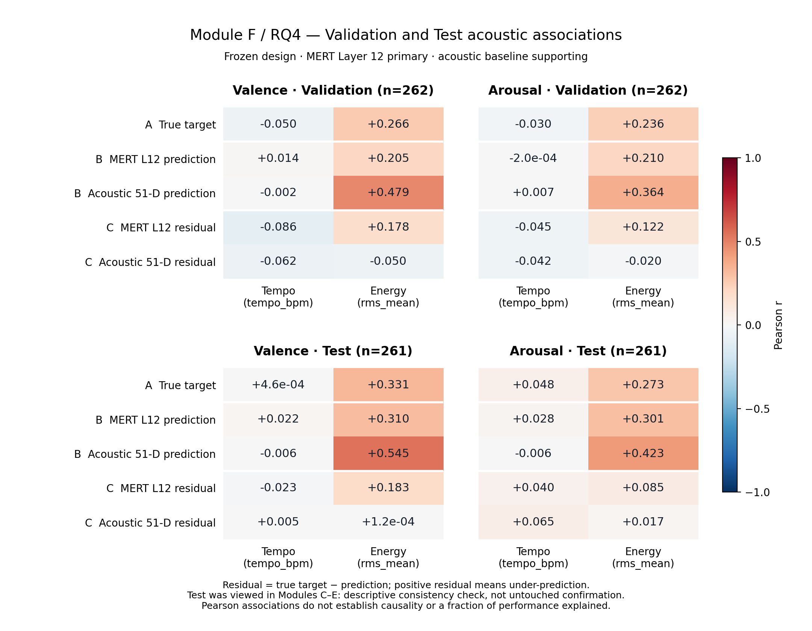

# Module F Stage 2 — Frozen Test Acoustic Association Analysis

## Objective, authorization and status

**RQ4: To what extent are the observed emotion-decoding results associated with simple acoustic correlates, particularly Tempo and Energy?**

On 2026-10-01 (researcher/client date, Australia/Sydney), the researcher stated that Stage 1 had passed researcher + ChatGPT review and explicitly authorized opening the Module F Test gate. This Stage applies the frozen Validation analysis to the 261 frozen Test samples, then compares the two partitions descriptively.

**Implementation and independent verification passed. Stage 2 interpretation/review is pending.** RQ4 now has the requested Validation and Test descriptive evidence for researcher interpretation, but Module F is not finalized. Work stops after this report; no further experiment or Module closure is performed.

The project workflow, roadmap, README, Module E log, Stage 1 report/scripts/results/analysis data/gate, and necessary C/E Test artifacts were read before implementation. Branch is `main`, HEAD `6957bf485fc70d807d15807ce7126303f83b0a31`. The existing eight Stage 1 files were untracked at entry and remain unchanged. The original Stage 1 report and pre-Test gate retain their historical closed/pending-review state; the new researcher prompt supplies the subsequent authorization, recorded separately in the Stage 2 verification JSON. Historical gate evidence was not overwritten.

## Frozen design reused unchanged

| Component | Definition |
|---|---|
| New analysis partition | Exactly 261 frozen Test IDs |
| Targets | Separate original-scale static Valence and Arousal |
| Tempo | `tempo_bpm` from the accepted acoustic NPZ |
| Energy | `rms_mean` from the same NPZ |
| Primary model | Pre-specified MERT Layer 12; saved Module C Test predictions |
| Supporting comparator | Frozen conventional acoustic 51-D model; saved Module E Test predictions |
| Layers | A: true target; B: model prediction; C: signed residual |
| Primary statistic | Pearson correlation coefficient, `r` |
| Residual | `y_true - prediction` |
| Positive residual | **Model under-predicts the target** |

The runner imports Stage 1's frozen target/correlate/object definitions and its exact `pearson` function. It does not execute Stage 1's runner or verifier. Thus the statistic, constant-input policy, object meanings and sign convention are reused directly, with only partition/population and existing prediction inputs changed. The Stage 2 JSON protocol equals Stage 1's protocol with `partition=test`.

No feature re-extraction, Tempo re-estimation, manual BPM repair, `whole_waveform_rms` substitution, `rms_std` addition, layer/feature selection, alpha tuning, refitting, MERT inference, Train analysis or new predictive model was introduced. No partial/conditional/nonlinear association, significance test, p-value, interval, bootstrap, new dataset or result-dependent robustness experiment was performed.

Tempo retains automated-estimation uncertainty. Energy remains the temporal mean of frame RMS from the decoded-amplitude → mono → 24 kHz path, a signal-level energy proxy affected by recording gain/production, rather than calibrated loudness or Arousal itself. Targets were not transformed. ID 437 retains the uncertain 117.1875 BPM estimate and original Train assignment; it is outside both analyzed partitions without a new exclusion decision.

## Test inputs and reused evidence provenance

| Input | Role |
|---|---|
| `data/metadata/deam_primary_split_seed42.csv` | Authoritative Test membership |
| `data/raw/deam/verification/deam_item_mapping.csv` | Original-scale, ID-keyed labels |
| `data/processed/deam_acoustic_51d.npz` | Frozen features, names and IDs |
| `outputs/results/module_c_stage4_test_predictions.csv` | **Reused Module C MERT Test evidence** |
| `outputs/results/module_c_stage4_test.json` | Layer-12, frozen-alpha and Train-only fitting provenance |
| `outputs/results/module_e_stage3_test_predictions.csv` | Reused frozen 51-D acoustic Test predictions |
| `outputs/results/module_e_stage3_test.json` | Acoustic representation, alpha and input provenance |
| Stage 1 association CSV and analysis data | Existing Validation values and independent verification |
| Stage 1 gate, scripts, report and figures | Frozen design/verification and unchanged-file snapshot |

All nine source inputs recorded in Stage 1, plus the four C4/E3 Test artifacts, have hash/size identities in the Stage 2 JSON. An additional snapshot protects all eight Stage 1 files, including its untracked report/gate and PNG/SVG. Stage 1 input/output/code identities still match its accepted record. C4/E3 recorded split, labels and cache identities match the current inputs; their predecessor and reused Module C evidence identities also match. Existing tracked files outside the exact Stage 2 file set match HEAD.

MERT alphas remain 1000/1000 for Valence/Arousal; acoustic alphas remain 100/10. The source records retain Train-only scaling/fitting and exclude Validation from final fitting. These are checked provenance facts; Stage 2 fits nothing. MERT is not evaluated again, and its saved predictions are not independent new model evidence.

**Test had already been viewed in Modules C–E.** This new association analysis is a frozen descriptive consistency check on another fixed partition. It is neither untouched confirmatory evidence nor an independent replication, and cannot retrospectively choose or change the Stage 1 design.

## Identity, alignment and three-layer calculation

The unchanged split has 1,744 unique primary IDs and counts 1,221/262/261 for Train/Validation/Test. Test and Validation are disjoint. Each Test source CSV contains exactly 522 rows, two targets × 261 IDs. Duplicate, missing, extra or wrong-partition prediction keys fail. Rows are aligned by `(sample_id, target)`, with the MERT representation fields uniformly `transformer_layer_12`/index 12 and acoustic rows uniformly `conventional_acoustic_51d`.

The frozen NPZ remains float32 `[1744, 51]` with 1,744 unique int64 Sample IDs. Its ordered feature names match E1/E2/E3. `tempo_bpm` and `rms_mean` are resolved by name to indices 0 and 1, matching Stage 1; no other feature enters a correlation. The monolithic cache is loaded for keyed access, but only Test rows enter the new associations. Numeric labels are parsed only after Test membership is established in the runner. The independent verifier additionally rechecks existing Validation data; no Train target analysis occurs.

Both saved `y_true` arrays exactly equal ID-aligned frozen labels with round-trip float parsing. The new analysis data contains 522 unique Sample-ID/target rows. Saved features and predictions exactly reproduce their source values; each residual exactly reproduces `y_true - prediction`. All analyzed values are finite.

The five analysis objects are `true_target`, `mert_layer12_prediction`, `acoustic51_prediction`, `mert_layer12_residual`, and `acoustic51_residual`. Two targets × two correlates × five objects produce **20 Test correlations**, each **n = 261**. Constant inputs would preserve Stage 1's empty CSV Pearson value, `undefined_constant_input` status and JSON record. No undefined case occurred in either partition.

## Test results

These are the Test observations themselves, before interpreting agreement with Validation. Values are Pearson `r`, rounded to nine decimal places; the CSV retains full precision.

| Analysis object | Valence: Tempo | Valence: Energy | Arousal: Tempo | Arousal: Energy |
|---|---:|---:|---:|---:|
| A — True target | 0.000463622 | 0.330604926 | 0.047930418 | 0.273461725 |
| B — MERT Layer-12 prediction | 0.021955071 | 0.309959395 | 0.027638662 | 0.300741208 |
| B — Acoustic 51-D prediction | -0.006004309 | 0.544524964 | -0.005555272 | 0.422842417 |
| C — MERT Layer-12 residual | -0.022604319 | 0.183379739 | 0.040409951 | 0.084605336 |
| C — Acoustic 51-D residual | 0.005182769 | 0.000123436 | 0.064916383 | 0.016597146 |

Tempo correlations are all numerically small, with largest absolute value approximately 0.065. Energy is positively associated with both true targets and both prediction branches. MERT residuals retain smaller positive Energy correlations (0.183 Valence, 0.085 Arousal), while acoustic residual Energy correlations are close to zero (0.000123 and 0.016597).

A positive Energy–residual correlation describes higher Energy covarying with larger signed residuals: a tendency toward greater under-prediction or less over-prediction. It does not imply every high-Energy item is under-predicted, or that the average residual is positive.

## Validation–Test descriptive comparison

### Tempo

The overall near-zero simple linear pattern persists descriptively: the observed absolute range is up to approximately 0.086 on Validation and 0.065 on Test. These are summaries of the observed numbers, not significance or consistency cutoffs.

The signs are not uniformly stable. True-Valence correlation changes from -0.049586 to +0.000464; true-Arousal from -0.029831 to +0.047930. MERT Arousal residual changes from -0.045116 to +0.040410, and acoustic Arousal residual from -0.042246 to +0.064916. Other small prediction/residual sign changes are retained in the complete comparison CSV. This does not supply a strong new Tempo-associated pattern or establish absence of all dependence; the cached Tempo measurement remains imperfect.

### Energy

| Analysis object | Valence Validation | Valence Test | Arousal Validation | Arousal Test |
|---|---:|---:|---:|---:|
| A — True target | 0.265603 | 0.330605 | 0.235629 | 0.273462 |
| B — MERT Layer-12 prediction | 0.205489 | 0.309959 | 0.209699 | 0.300741 |
| B — Acoustic 51-D prediction | 0.479110 | 0.544525 | 0.364227 | 0.422842 |
| C — MERT Layer-12 residual | 0.177979 | 0.183380 | 0.122148 | 0.084605 |
| C — Acoustic 51-D residual | -0.049686 | 0.000123 | -0.020146 | 0.016597 |

The principal structure is consistent descriptively: positive Energy associations with targets and predictions; larger Energy–prediction correlations for the supporting acoustic branch than for MERT; smaller positive Energy–MERT-residual correlations; and near-zero Energy–acoustic-residual correlations.

Differences are retained. Target and prediction Energy correlations are numerically larger on Test. MERT Valence residual correlation is similar (0.178 → 0.183), while its Arousal residual correlation is lower (0.122 → 0.085). Acoustic residual Energy signs change from small negative Validation values to small positive Test values. Energy–true-Valence correlation remains numerically larger than Energy–true-Arousal, without a claim about a population difference.

The machine-readable [comparison](../../outputs/results/module_f_stage2_validation_test_comparison.csv) copies all 20 Validation/Test coefficients side by side, with counts, status, sign and residual metadata. `same_direction`/`different_direction` refers only to exact mathematical signs. It is **not** a replicated/failed label, a binary statistical consistency verdict or a significance threshold; even tiny nonzero values retain their signs. Descriptive strength and consistency are interpreted in this report with the full values visible.



This single comparison figure preserves Stage 1's five rows, two correlate columns and common -1 to +1 diverging scale. Two target panels are shown for each partition, covering all 40 saved coefficients with the respective sample counts. Tiny values use scientific notation rather than appearing to be exact zero. PNG and SVG are two formats of the same figure. The PNG was visually inspected for readability/clipping; Stage 1's figure remains byte-for-byte unchanged.

## Independent verification and reproducibility

The separate verifier imports neither runner. It reopens source and derived artifacts, reverses input order, joins with stdlib CSV ID dictionaries, checks exact features/labels/predictions/residuals, and computes Pearson using centered `math.fsum` covariance and variance sums rather than the runner's frozen `numpy.corrcoef` function.

**All 20 runner checks and 26 independent checks passed.** Test 20/20 correlations independently reproduce with maximum absolute difference **9.992007221626409e-16**; existing Validation 20/20 reproduce with maximum difference **2.7755575615628914e-16**. Both are within `1e-12`, a numerical implementation tolerance rather than an uncertainty or significance threshold. All 20 comparison rows exactly match their source float values, metadata and exact-sign descriptions. Undefined counts are zero in both partitions.

Checks cover frozen identity/counts, composite keys, named-column resolution, original-scale targets, source prediction and fitting provenance, row-order independence, residual sign/formula, numerical finiteness, unchanged Stage 1/C/E artifacts, authorization and prior Test exposure. A static scope audit checks the runner, verifier and imported Stage 1 definitions for fitting/inference/audio dependencies and calls; no fitting, extraction, prediction generation or selection occurs. Both scripts record no Train association analysis. Hash/size identities are checked before and after verification.

The new scientific CSVs were regenerated once to refresh the finalized independent-verifier code identity; **all three CSVs reproduced byte-for-byte**. This was deterministic reproduction of the same saved-prediction analysis, without a new model evaluation. Figure/JSON timestamps may differ on reproduction. The final [verification JSON](../../outputs/results/module_f_stage2_final_verification.json) combines authorization, the before/after snapshots, protocol, provenance, checks and numerical agreement, avoiding a separate start-record artifact. Authorization is written before Test calculations, and the record is completed afterward. A verifier rerun first invalidates a previous pass, so a failing rerun cannot leave stale success.

Run from the repository root with the existing local cache/mapping and project environment:

```powershell
Set-Location -LiteralPath 'C:\Users\Rinshinozaki\Documents\ChatGPT\AI music mini proj\mert-emotion-probing'
& 'C:\Users\Rinshinozaki\miniconda3\envs\mert-emotion\python.exe' -m py_compile scripts/run_acoustic_association_test.py scripts/verify_acoustic_association_test.py
& 'C:\Users\Rinshinozaki\miniconda3\envs\mert-emotion\python.exe' scripts/run_acoustic_association_test.py
& 'C:\Users\Rinshinozaki\miniconda3\envs\mert-emotion\python.exe' scripts/verify_acoustic_association_test.py
git status --short
git diff --stat
git diff --check
```

Python 3.10.21, NumPy 2.2.6, pandas 2.3.3 and matplotlib 3.10.9 were reused. No dependency/environment change was needed. Commands replace only the same Stage 2 artifacts; do not rerun the Stage 1 runner/verifier, which would rewrite its historical outputs.

## Interpretation, unexpected observations and remaining decision

The two partitions provide a **consistent descriptive Energy-associated structure**, while Tempo offers little evidence of a simple linear association under these frozen measurements. MERT predictions track some Energy-associated structure, and the smaller positive Energy–residual association remains visible on Test. This supports a **plausible partial acoustic explanation** for observed emotion decoding in this setting. It does not determine an exact share of performance explained.

The supporting acoustic branch tracks Energy more strongly in its predictions, while its signed residual Energy correlations remain near zero overall. That does not establish better overall accuracy, small residual error, acoustic independence or exhaustion of acoustic information. The branch's representation already contains Tempo/RMS among 51 features.

The observations requiring interpretation are the retained small Tempo sign changes, stronger Test Energy target/prediction correlations, lower Test MERT Arousal residual Energy correlation, and acoustic residual Energy sign reversals around zero. No explanation was invented or additional experiment added to resolve them. No schema conflict, nonfinite value, missing sample or frozen-design conflict was found.

These correlations do not establish causal confounding, that Tempo/Energy cause MERT performance, unique emotion information beyond acoustics, high-level emotion understanding in residuals, statistical significance/replication, universal relationships or cross-dataset generalization. Near-zero Pearson does not rule out all dependence. Comparing correlations of targets, predictions and residuals is not a conditional information analysis; residual correlation cannot be obtained by subtracting the other two correlations.

**The requested RQ4 descriptive evidence is sufficient for researcher interpretation under the frozen scope.** No implementation issue requires a protocol change. The remaining decision is researcher + ChatGPT review of Stage 2's interpretation and whether to finalize Module F afterward. No final log, personal note, README update, extra experiment, commit or push is authorized by this implementation step.

## Files and Git state

Nine files were created; no pre-existing file was modified:

- `scripts/run_acoustic_association_test.py`
- `scripts/verify_acoustic_association_test.py`
- `outputs/results/module_f_stage2_test_analysis_data.csv`
- `outputs/results/module_f_stage2_test_associations.csv`
- `outputs/results/module_f_stage2_validation_test_comparison.csv`
- `outputs/results/module_f_stage2_final_verification.json`
- `outputs/figures/module_f_stage2_validation_test_associations.png`
- `outputs/figures/module_f_stage2_validation_test_associations.svg`
- `docs/codex_reports/module_f_stage2_frozen_test_acoustic_association_analysis.md`

Branch/HEAD remain unchanged. The tracked diff is empty. All nine Stage 2 files are untracked, alongside the eight existing Stage 1 files and pre-existing `docs/.obsidian/`. Nothing was staged, committed or pushed. `docs/.obsidian/` was not read or changed. README, Module-level logs and personal notes were not edited or created.

## What I should now be able to explain

- **Why repeat the Validation design exactly on Test?** Changing cues, models, statistic or sample policy after seeing Validation would turn the comparison into a different question. Fixed definitions make the observed partition differences interpretable.
- **What happened with Tempo?** Both partitions show small simple linear coefficients overall. Multiple small signs change on Test, so direction is not uniformly stable; near-zero association is not proof that all tempo-related dependence is absent.
- **What happened with Energy?** Both partitions show positive target/prediction association and smaller positive MERT residual association. Acoustic predictions follow Energy more strongly; their residual associations stay near zero, with small sign changes.
- **What do A/B/C add?** A describes the annotations, B the accepted model outputs, and C how remaining signed errors vary with a cue. Prediction and residual patterns add information beyond label correlation without identifying a causal mechanism.
- **How do the model branches differ?** MERT and acoustic predictions share the positive Energy structure, with different magnitudes and residual patterns. The acoustic branch is a supporting reference rather than a new independent research question.
- **Why only a plausible partial acoustic explanation?** Observed shared structure is compatible with an acoustic contribution, but Pearson is not an intervention, conditional analysis or performance decomposition. It cannot establish causality or a fraction explained.
- **Why does prior Test exposure matter?** C–E already viewed this fixed Test partition. New descriptive associations cannot make the data untouched or the reused model evidence an independent replication.
- **What has RQ4 answered?** It describes how the two agreed acoustic cues accompany labels, predictions and signed residuals on the frozen Validation/Test partitions. It has not identified causes, all possible acoustic explanations, unique emotion information or generalization to another dataset.

Stage 2 ends here, awaiting researcher + ChatGPT review.
