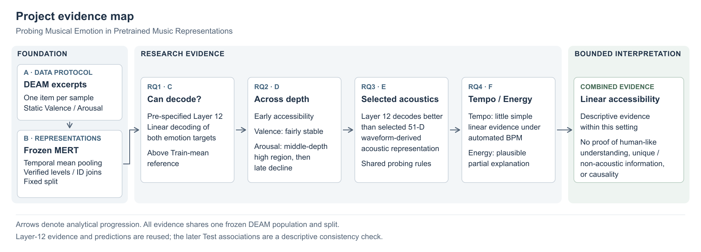

# Probing Musical Emotion in Pretrained Music Representations

## Abstract

This study examines the linear accessibility of continuous musical emotion in frozen MERT representations using 1,744 DEAM excerpts with static Valence and Arousal annotations. Separate Ridge probes were fitted under one fixed Train/Validation/Test protocol, with Train-only standardization and fitting and Validation-only regularization selection. The pre-specified Layer-12 representation decoded both targets on held-out Test excerpts better than constant Train-mean references. Extending the probe across 13 representation levels showed early accessibility, comparatively stable Valence after early gains, and a broad middle-depth Arousal high region followed by a late decline. Layer 12 also produced stronger held-out metrics than a selected 51-dimensional conventional acoustic representation. Pearson associations with targets, saved predictions and signed residuals provided little evidence for a simple linear Tempo explanation under automated BPM, while Energy-associated structure supported a plausible partial acoustic explanation. These findings connect predictive performance, representation depth and acoustic association without treating them as interchangeable evidence. They support a bounded account of linear decodability in this excerpt population, rather than human-like emotion understanding, unique non-acoustic information or causality. The later Test association analysis is descriptive following prior Test exposure.

## Introduction / Motivation

Pretrained music representations provide a way to study whether properties of a recording are accessible without retraining the representation model for each task. Musical emotion is a useful case because its continuous annotations describe perceived affect, while the recording also contains acoustic variation that may covary with those annotations. Successful emotion prediction therefore requires careful interpretation of the evidence about the representation and its possible acoustic explanations. This study addresses that problem through a restricted probe and a sequence of descriptive comparisons.

The targets are the static averaged Valence and Arousal annotations in DEAM. Valence concerns perceived pleasantness or positivity, while Arousal concerns emotional activation. Each annotation pair describes an audio item rather than an instantaneous event. The representation model is frozen MERT-v1-95M, and the supervised component is a regularized linear regression. This separation makes the empirical question one of linear accessibility: whether a simple learned mapping from a specified representation can predict the annotations on samples outside its fitting data. It does not require interpreting the model's internal features as explicit emotion concepts.

Depth and representation comparisons sharpen this question. A positive result at the final Transformer layer does not establish where accessibility begins or whether additional depth consistently improves it. Examining all representation levels can reveal a distributed or target-dependent pattern that an endpoint alone would conceal. A comparison with conventional waveform-derived features then places the pretrained representation's predictive result against a compact acoustic alternative. Keeping the same population, split and probe limits changes in the evaluation framework, while preserving the distinction between the representations being compared.

The broader motivation includes whether a pretrained representation offers emotion-related information beyond simple acoustics. A performance comparison alone cannot answer that conceptual question: a selected feature recipe is not an exhaustive description of acoustic information, and stronger prediction does not establish independence from acoustic correlates. Tempo and Energy associations are therefore examined in the annotations, predictions and errors. These observations constrain the interpretation of the decoding results without attempting to estimate a causal contribution or a fraction of performance explained.

The resulting study moves from establishing decodability to describing its distribution across depth, comparing a pre-specified representation with selected acoustics, and assessing two plausible acoustic correlates. Figure 1 summarizes that progression. The data and representation protocol supply a shared foundation; the arrows organize the questions and their interpretation rather than asserting independent experiments.

*Figure 1. Research progression from the DEAM protocol and frozen representations to the four operational questions and their combined interpretation. All evidence uses the same frozen population and split. Layer-12 results and saved predictions are reused where indicated in the report; later Test associations follow prior Test exposure. Arrows denote analytical progression, not causality, an execution pipeline or independent tests. [SVG version](../outputs/figures/project_evidence_map.svg).*

## Research Questions

The four operational questions are:

1. **RQ1:** Can continuous Valence and Arousal be linearly decoded from the pre-specified frozen MERT Layer-12 representation?
2. **RQ2:** How does linear Valence and Arousal decodability vary across the 13 frozen MERT representation levels?
3. **RQ3:** How does emotion decodability from the pre-specified MERT Layer-12 representation compare with a conventional low-level acoustic representation under the same linear probing framework?
4. **RQ4:** How are the observed Valence and Arousal decoding results associated with Tempo and Energy under the frozen analysis protocol?

These questions narrow the broader acoustic-information motivation to observations supported by the completed study. RQ1 establishes an endpoint result; RQ2 describes accessibility across depth. RQ3 introduces a selected representation comparison, and RQ4 examines acoustic associations relevant to its interpretation. The [frozen roadmap](research_roadmap_after_module_d.md) records this distinction between conceptual motivation and operational scope.

## Method

### Data and representations

The primary population comprises 1,744 approximately 45-second DEAM excerpts. The 58 metadata-defined full songs are excluded; membership is determined by the dataset subsets rather than an arbitrary duration cutoff. One audio item is one supervised sample, paired with static averaged `valence_mean` and `arousal_mean`. Targets remain on the original 1–9 rating scale and are modeled separately. Using the annotation unit directly avoids treating multiple clips with the same inherited static label as separate primary observations. The [accepted data protocol](research_logs/module_a_data_and_representation_protocol.md) documents population verification and the exclusion rationale.

Audio handling preserves actual decoded duration without cropping or padding to exactly 45 seconds. Multichannel audio is converted to mono by arithmetic channel averaging and resampled to 24 kHz. MERT extraction retains the official feature extractor's configured normalization, with no additional project-level loudness or peak normalization. The model is frozen, in evaluation mode, with gradients disabled. Independent single-item inference is used because padded multi-item extraction was not representation-equivalent under the validated protocol; the detailed investigation is retained in the [representation-construction record](research_logs/module_b_representation_extraction_and_dataset_construction.md).

Each item yields 13 hidden-state sequences, each temporally mean-pooled to a 768-dimensional vector. Index 0 denotes Pre-Transformer, and indices 1–12 denote Transformer Layers 1–12. Pre-Transformer already includes learned frontend and encoder-input processing, including positional convolution and normalization; it is not raw audio. Probes use one level at a time, with no layer concatenation. Layer 12 was specified for RQ1 before the depth analysis and remains the comparator for RQ3 and the primary prediction branch for RQ4.

The conventional representation contains 51 waveform-derived features: one global Tempo estimate; mean and standard deviation of frame RMS; these two statistics for MFCC coefficients 1–20, excluding coefficient 0; and the same statistics for spectral centroid, bandwidth, 0.85 rolloff and zero-crossing rate. Audio uses the same decoded-duration, mono and 24-kHz policy, with frame length 2,048 and hop 512 and a Hann window where applicable. RMS is extracted from decoded-amplitude audio before MERT input normalization. The [accepted acoustic protocol](research_logs/module_e_conventional_acoustic_baseline.md) provides the exact extraction specification. This fixed compact recipe supplies a selected acoustic comparator, rather than a complete inventory of conventional acoustic information.

### Probing and evaluation

Representations, labels and split assignments are joined by Sample ID. One fixed sample-level split, created with seed 42, contains 1,221 Train, 262 Validation and 261 Test items; the [split artifact](../data/metadata/deam_primary_split_seed42.csv) is shared throughout. Each target and representation configuration receives its own Ridge regression with an intercept and deterministic Cholesky solver. Input standardization is fitted on Train only, as are the regression coefficients and the constant Train-target-mean reference. Targets are not standardized.

The predeclared regularization grid is `1e-4, 1e-3, 1e-2, 1e-1, 1, 10, 100, 1000, 10000`. Each configuration selects alpha by maximum Validation R²; an exact numerical tie selects the larger alpha. The selected configuration is then fitted using Train only. Validation is not combined with Train for final fitting, and Test is excluded from scaling estimation, coefficient fitting and selection. The same framework and tuning opportunity apply to the MERT and acoustic branches. This does not equalize their 768 versus 51 input dimensions or effective capacity.

Evaluation reports mean absolute error (MAE), R² and Pearson r. MAE measures prediction error on the original target scale. R² compares squared prediction error with variation around the evaluated partition's target mean; Pearson r describes linear covariation between predictions and targets. The Train-mean reference therefore need not have exactly zero Test R², and its Pearson r is undefined because its predictions are constant. The depth analysis reports the complete predeclared Test R² trajectory. Its observed maxima do not select a replacement for Layer 12.

### Acoustic associations and evidence provenance

RQ4 uses cached `tempo_bpm` and `rms_mean` as Tempo and Energy. For each target, Pearson r relates each cue to five objects: the true target, MERT prediction, acoustic prediction, MERT residual and acoustic residual. Residual is defined as `y_true - prediction`, so a positive value indicates under-prediction. Associations are reported separately for Validation and Test, reusing saved predictions without new fitting, extraction or MERT inference. The analysis definitions are documented in the [accepted association record](research_logs/module_f_acoustic_correlate_and_error_analysis.md).

C4 is the original protected Layer-12 Test evaluation. The later depth analysis contains 24 new level/target evaluations and two reused Layer-12 results; the acoustic comparison likewise reuses C4 as its MERT evidence. RQ4 reuses saved predictions from both branches. Validation had already supported model selection, and Test had been viewed in the preceding decoding analyses, so the later Test associations are a frozen descriptive consistency check, not independent replication or untouched confirmation. Reuse supplies continuity across questions without creating independent new MERT evidence. No post-Test tuning occurred.

## Results

### RQ1: Held-out linear decodability

Both Layer-12 probes achieved positive Test R² and positive prediction–target correlation, with lower MAE than their Train-mean references (Table 1). Improvements in absolute and squared prediction error were accompanied by positive linear covariation with the true targets. The constants' slightly negative R² values are consistent with their construction from Train means, while their undefined correlations reflect zero prediction variance.

**Table 1. Frozen Test performance for RQ1 and RQ3.** All rows use the same 261 Test excerpts. MERT and reference values come from the [authoritative C4 Test JSON](../outputs/results/module_c_stage4_test.json); acoustic values come from the [E3 Test JSON](../outputs/results/module_e_stage3_test.json), with comparison provenance in the [RQ3 CSV](../outputs/results/module_e_stage3_rq3_comparison.csv). Metrics are displayed to nine decimal places. The MERT rows serve both questions and are reused C4 evidence for RQ3; acoustic rows are the later RQ3 comparator. References are shared across representations. Undefined Pearson r is stored as JSON `null`, not zero.

| Target | Representation / Reference | Test MAE | Test R² | Test Pearson r |
|---|---|---:|---:|---:|
| Valence | MERT Layer 12 | 0.635144565 | 0.579780312 | 0.768855324 |
| Valence | Acoustic 51-D | 0.770499050 | 0.368149823 | 0.609708274 |
| Valence | Train-mean reference | 1.002563190 | -0.003113807 | undefined |
| Arousal | MERT Layer 12 | 0.744556180 | 0.511421706 | 0.715509311 |
| Arousal | Acoustic 51-D | 0.860429090 | 0.374161643 | 0.611792750 |
| Arousal | Train-mean reference | 1.131995632 | -0.000320133 | undefined |

The [accepted RQ1 record](research_logs/module_c_basic_probing_and_emotion_decodability.md) also retains the Validation results. Arousal had higher error and lower R² and correlation on Test than on Validation, while Valence was more similar across partitions. These observations were retained without altering the fitted configuration. Table 1 presents the original held-out result once, so its later use in the representation comparison does not duplicate an evaluation.

### RQ2: Accessibility across depth

Both targets were already linearly decodable at Pre-Transformer, with Test R² of 0.526720395 for Valence and 0.536628663 for Arousal. Figure 2 shows the complete trajectory. Valence improved early and then varied nonmonotonically within a comparatively stable range. Arousal rose into a broad high region across Layers 3–9 and declined across the later levels. The final layer therefore did not mark the first appearance of accessibility, and greater depth did not improve both targets in the same way.

*Figure 2. Unchanged depth trajectory from the [accepted RQ2 record](research_logs/module_d_layerwise_emotion_decodability_analysis.md), with the [full numerical table](../outputs/results/module_d_stage1_layerwise_results.csv) as its source. Each level has a separate Validation-selected Ridge probe. Open Layer-12 markers identify reused C4 values. The connected points show the complete frozen trajectory without smoothing or uncertainty bands; they do not establish a universally best layer.*

Every level/target configuration had positive Test R², positive Pearson r and lower MAE than its reference. The main result is the difference between the two trajectories, rather than a ranking of small numerical gaps. The broad Arousal high region describes the observed curve; it does not assert equality or statistical indistinguishability of its levels. Layer 12 remained the pre-specified comparator after this analysis.

### RQ3: Comparison with selected conventional acoustics

For both targets, MERT Layer 12 had lower Test MAE and higher Test R² and Pearson r than the selected Acoustic 51-D representation (Table 1). The acoustic probes also had positive R² and lower MAE than their Train-mean references. Thus the comparison includes positive acoustic decodability alongside the stronger MERT result, under the same sample assignment and linear probing framework.

The MERT rows are the existing RQ1 observations, not a new evaluation. The acoustic branch was evaluated using its frozen Validation-selected configurations with Train-only fitting. These results describe the selected representations and do not supply a capacity-matched or exhaustive comparison of acoustic information. The [accepted RQ3 record](research_logs/module_e_conventional_acoustic_baseline.md) retains the full selection and comparison provenance.

### RQ4: Tempo and Energy associations

Tempo correlations with targets, both prediction branches and both residual branches were small in absolute magnitude in both partitions (Figure 3). Some small coefficients changed sign between Validation and Test. Under this automated BPM measurement, the observations provide little descriptive evidence for a simple linear Tempo explanation; exact sign agreement was not a statistical consistency criterion.

*Figure 3. Unchanged two-partition association figure from the [accepted RQ4 record](research_logs/module_f_acoustic_correlate_and_error_analysis.md). It displays the full frozen set of Tempo/Energy coefficients for each target, prediction and residual. Validation has 262 samples and Test 261. Predictions are reused; residual is true target minus prediction. Test follows prior exposure and supplies a descriptive consistency check. Full coefficients are in the [Validation/Test comparison CSV](../outputs/results/module_f_stage2_validation_test_comparison.csv).*

Energy was positively associated with the true targets and MERT predictions in both partitions (Table 2). Smaller positive associations remained in MERT residuals. Target and prediction correlations were higher in Test than in Validation; the MERT Valence residual association was similar across partitions, while the Arousal residual association was smaller in Test. These magnitude differences are descriptive observations from the saved coefficients.

**Table 2. Pearson r with Energy (`rms_mean`).** This reproduces the accepted Energy table, formatted to six decimal places from the [Validation associations](../outputs/results/module_f_stage1_validation_associations.csv) and [Test associations](../outputs/results/module_f_stage2_test_associations.csv). Partitions remain separate.

| Analysis object | Valence Validation | Valence Test | Arousal Validation | Arousal Test |
|---|---:|---:|---:|---:|
| True target | 0.265603 | 0.330605 | 0.235629 | 0.273462 |
| MERT Layer-12 prediction | 0.205489 | 0.309959 | 0.209699 | 0.300741 |
| Acoustic 51-D prediction | 0.479110 | 0.544525 | 0.364227 | 0.422842 |
| MERT Layer-12 residual | 0.177979 | 0.183380 | 0.122148 | 0.084605 |
| Acoustic 51-D residual | -0.049686 | 0.000123 | -0.020146 | 0.016597 |

The acoustic predictions showed stronger positive Energy associations than the MERT predictions, while their residual associations were near zero. Small negative acoustic residual coefficients on Validation became near-zero positive coefficients on Test. RQ4 did not refit either branch or produce a further model-performance evaluation; its evidence concerns how existing predictions and errors covary with the two descriptors.

## Discussion

The combined evidence supports a representation-level account of linear accessibility. Successful Layer-12 decoding establishes that a restricted mapping can generalize from the frozen representation to both annotations in this setting. The depth trajectory then changes how that endpoint should be understood: accessibility is present before the first Transformer layer and persists with different patterns for the two targets. Valence remains comparatively stable after early gains, whereas Arousal is more accessible to the tested probes in a broad middle-depth region than at the endpoint. The study therefore supports distributed, target-dependent accessibility across representation depth, without treating final-layer performance as a complete description of the representation.

This distinction matters because probing performance concerns the mapping available to a particular readout. A later-layer decline need not be interpreted as a direct measure of lost emotion information, just as early decoding does not establish an explicit emotion mechanism in the frontend. The observations are conditioned on temporal mean pooling, feature standardization and regularized linear regression. The different target trajectories show why a single monotonic narrative about deeper representations would be inadequate. Keeping Layer 12 for the subsequent comparison preserves the original question and avoids converting descriptive Test maxima into a newly selected comparator.

The conventional acoustic results place this account in a broader predictive context. The selected features themselves support positive held-out decodability, while the pre-specified MERT representation provides stronger metrics under the shared framework. That difference establishes comparative performance for the two fixed representations, but does not locate its source in unique emotion information. A compact waveform-derived recipe can leave acoustic variation unrepresented, and its dimensionality and effective capacity differ from MERT's. The shared evaluation procedure makes the comparison interpretable within the study; it does not transform it into a test of independence from all acoustics.

The Energy associations give a concrete reason to retain that boundary. Energy covaries positively with the annotations and with MERT predictions across both partitions, so Energy-associated structure is present in the quantities whose relationship underlies decoding. The smaller positive associations in MERT residuals extend the pattern into the remaining errors. Together these observations support the accepted interpretation of Energy as a plausible partial acoustic explanation, without specifying how the representation or probe uses it. The residuals do not identify what the remaining information represents, and Pearson r provides no estimate of a fraction of decoding performance explained. RQ4 consequently constrains the stronger RQ3 result without assigning it a causal decomposition.

Prediction quality and acoustic association also need separate interpretations. Acoustic predictions track Energy more strongly, and their residual Energy correlations are near zero, yet their overall emotion metrics are weaker than MERT's. More direct agreement with one descriptor therefore does not imply a more accurate predictor of the complete target. Since RMS mean is itself included in the acoustic representation, this pattern is interpretable in the context of the feature recipe, but it does not isolate that feature's contribution. Likewise, small Tempo correlations limit the available simple-linear evidence under the chosen BPM measurement; they cannot establish the absence of nonlinear, conditional or other Tempo dependence.

The synthesis is thus supported by connected evidence with distinct roles: held-out accessibility, a full depth pattern, a selected acoustic comparison and descriptive cue associations. The questions share data and sometimes the same predictions, so their convergence is an integrated interpretation of one study rather than multiple independent confirmations. Within those constraints, the results show positive held-out linear emotion decoding from a frozen pretrained representation while retaining plausible acoustic explanations. They do not warrant attributing human-like emotion understanding, acoustic independence or a causal emotion mechanism to MERT.

## Limitations

The population and targets bound generalization. Results describe one fixed split of the 1,744 DEAM excerpts, excluding the metadata-defined full songs. Static averaged ratings describe item-level perceived affect; they do not establish how a model follows emotion changes within an excerpt or individual listeners' responses. The study does not establish transfer to another dataset, annotation procedure or full-song setting. Reported metrics are descriptive point estimates, with no uncertainty intervals, significance tests, multi-seed aggregation or cross-validation. Small numerical layer gaps therefore cannot support a unique or universally optimal level, and comparing target-normalized R² does not establish that one emotion dimension is intrinsically easier.

Representation and readout choices further restrict the findings. A successful regularized linear probe demonstrates accessibility under that probe, rather than complete information content or a general measure of what the model understands. Temporal mean pooling removes order and can smooth brief events. The approximately 45-second extraction pass is longer than the checkpoint's documented 5-second pretraining context; verified execution does not establish invariance to that context difference. Independent extraction fixes representation consistency under the accepted protocol, but does not resolve the context or pooling limitations. The 768-dimensional MERT and 51-dimensional acoustic inputs also remain unequal in dimension and effective capacity despite common fitting and selection rules.

The acoustic descriptors have measurement limits. Energy is RMS from decoded recording amplitude, influenced by gain and production, rather than calibrated perceptual loudness or the Arousal label itself. Automated BPM is subject to weak onsets, beat-tracking uncertainty and half/double-tempo ambiguity. The accepted extraction retained uncertain finite estimates rather than correcting them using emotion labels. Pearson associations are marginal descriptive relationships; they neither identify causal confounding nor remove it. Near-zero residual correlation with a cue cannot identify the contents of remaining information or prove independence from other acoustic factors. Genre remains deferred, and Instrumentation is outside the completed core analysis.

Evidence history limits the strength of confirmation. The original protected Layer-12 Test evaluation provides the endpoint evidence, while later questions reuse that evidence or its predictions. Validation was previously involved in selecting the probes, and Test was already viewed before the association analysis. Frozen rules and the absence of post-Test tuning preserve the recorded analyses, but do not make later Test observations untouched evidence or independent replication. The report therefore retains their descriptive status and treats the combined findings as one bounded study.

## Conclusion

Continuous Valence and Arousal are linearly decodable from the pre-specified frozen MERT Layer-12 representation on the studied DEAM Test excerpts. Accessibility is already present early and varies differently across depth for the two targets. Under the shared probing framework, Layer 12 gives stronger held-out metrics than the selected compact acoustic representation. Tempo supplies little simple-linear evidence under automated BPM, while Energy associations with targets, predictions and residuals support a plausible partial acoustic explanation. These observations form a coherent account of representation accessibility and prediction behavior in one setting. They establish neither unique non-acoustic emotion information nor human-like understanding or causality, and the later Test associations remain descriptive following prior exposure.

**Sources and reproducibility.** Numerical authority is linked beside each table and figure; the [accepted research logs](research_logs/) retain methodological decisions and interpretation. Dataset and model attribution are documented in the [DEAM protocol](research_logs/module_a_data_and_representation_protocol.md) and [MERT research record](codex_reports/module_a_stage2_mert_research.md). Detailed commands, environment checks and verification history remain in the [Stage reports](codex_reports/), with tracked [implementation](../src/), [scripts](../scripts/) and [environment specification](../environment.yml). Raw DEAM audio, model weights and generated representation/acoustic caches remain local and excluded from version control. This report presents the frozen evidence without new experiments or metric recomputation.
